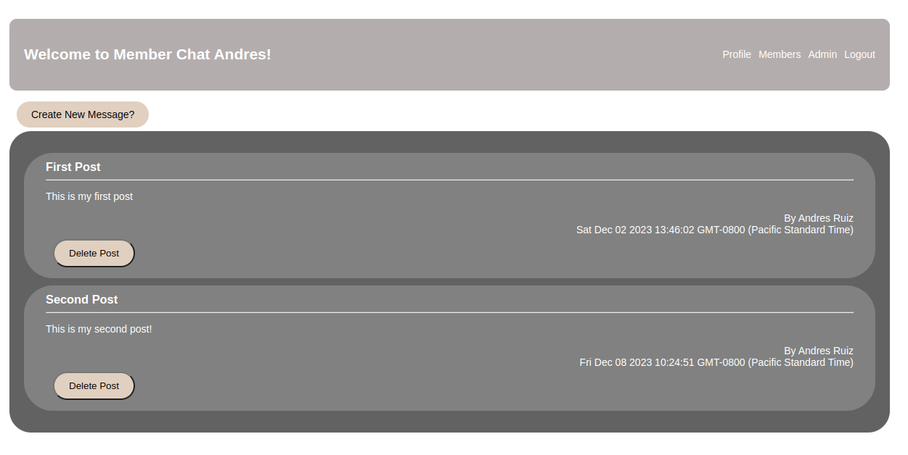

# membersOnly

This is a project to practice authentication. It will use pug, express, bcrypt, passport, and mongoose.

### Description

This app will just be a message board that only allows members to see who posted the message, those who are not members will not see who posted

